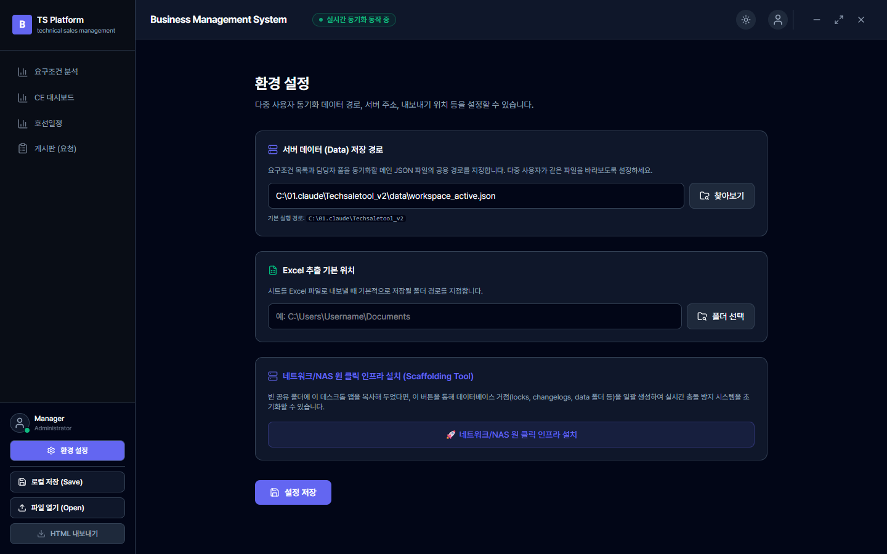
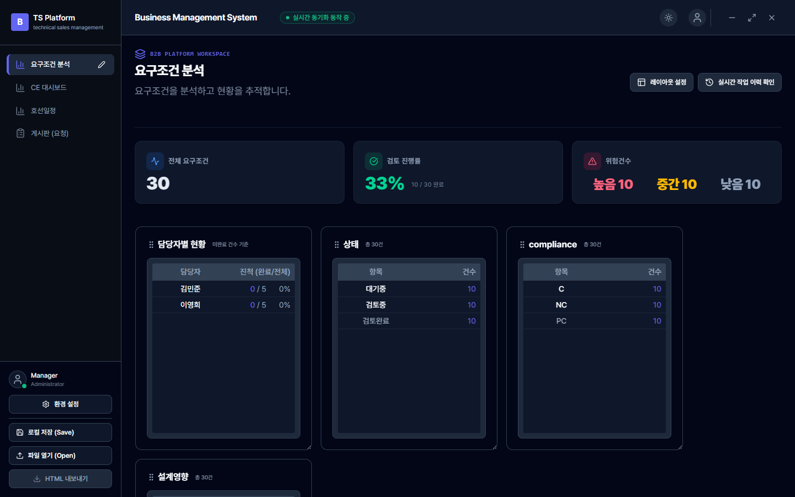
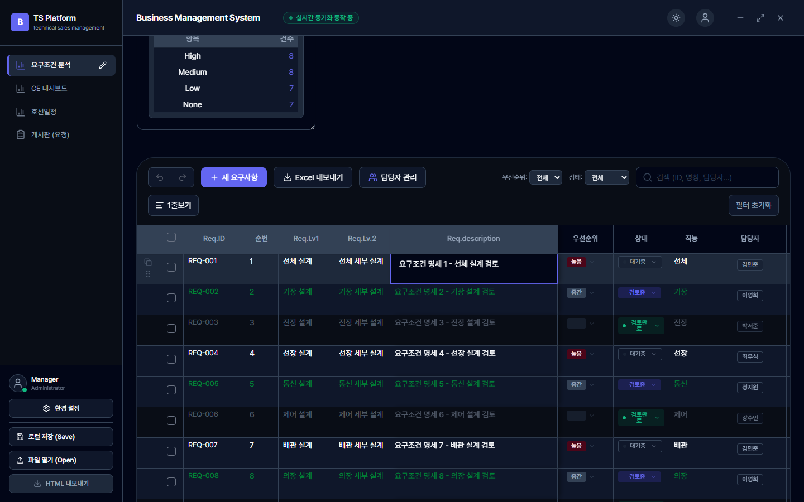
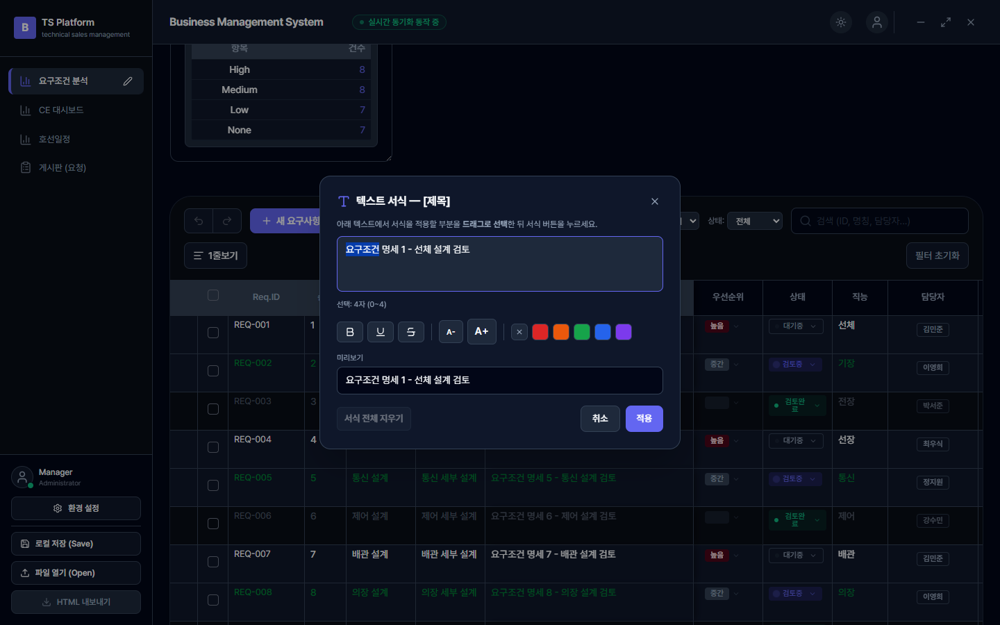
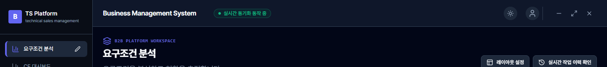
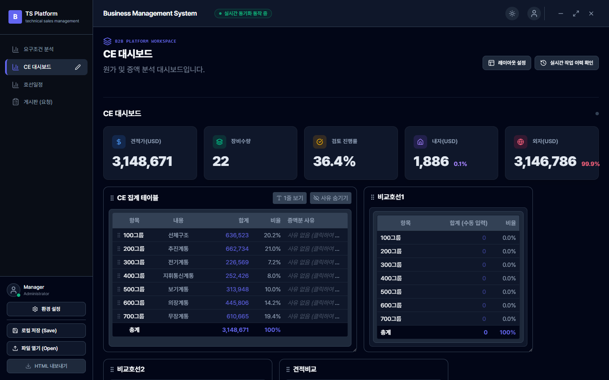
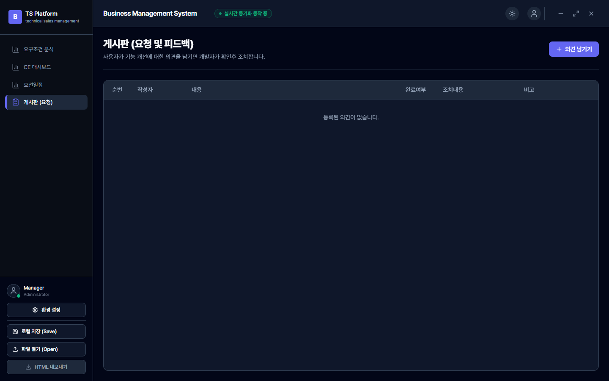

# TS Platform 사용자 설명서

> **Business Management System / B2B Platform Workspace**
> 요구조건(요구사항)을 여러 사람이 **동시에** 표(스프레드시트) 형태로 관리하는 협업 프로그램입니다.
> 이 문서는 처음 쓰는 분도 따라 할 수 있도록 **구동 환경 → 화면 구성 → 단계별 사용법 → 다중 사용자 유의사항** 순서로 설명합니다.

---

## 목차

- [1부. 앱 구동 환경과 동작 원리](#1부-앱-구동-환경과-동작-원리)
  - [1-1. 이 앱은 무엇인가요](#1-1-이-앱은-무엇인가요)
  - [1-2. 두 가지 구동 방식 — 데스크톱 앱 vs 웹](#1-2-두-가지-구동-방식--데스크톱-앱-vs-웹)
  - [1-3. 데이터는 어디에 저장되나요 (저장 경로·폴더 구조)](#1-3-데이터는-어디에-저장되나요-저장-경로폴더-구조)
  - [1-4. 데이터가 오가는 원리 (로드 → 편집 → 저장 → 동기화)](#1-4-데이터가-오가는-원리-로드--편집--저장--동기화)
  - [1-5. 서버(공유 경로) 환경 설정 절차](#1-5-서버공유-경로-환경-설정-절차)
- [2부. 화면 구성 한눈에 보기](#2부-화면-구성-한눈에-보기)
- [3부. 단계별 사용법](#3부-단계별-사용법)
  - [3-1. 요구조건(행) 추가·삭제](#3-1-요구조건행-추가삭제)
  - [3-2. 셀 편집하기](#3-2-셀-편집하기)
  - [3-3. 엑셀에서 복사·붙여넣기 (들여쓰기 유지)](#3-3-엑셀에서-복사붙여넣기-들여쓰기-유지)
  - [3-4. 셀 안 텍스트 일부만 서식 바꾸기 (굵기·색상·밑줄·취소선·크기)](#3-4-셀-안-텍스트-일부만-서식-바꾸기-굵기색상밑줄취소선크기)
  - [3-5. 정렬·필터·검색](#3-5-정렬필터검색)
  - [3-6. 저장 · 열기 · 내보내기](#3-6-저장--열기--내보내기)
- [4부. 대시보드·게시판](#4부-대시보드게시판)
- [부록 A. 다중 사용자 협업 시 유의사항 ⭐](#부록-a-다중-사용자-협업-시-유의사항-)

---

# 1부. 앱 구동 환경과 동작 원리

## 1-1. 이 앱은 무엇인가요

여러 명이 **하나의 요구조건 목록(표)** 을 같이 편집하는 도구입니다. 엑셀과 비슷하게 생겼지만, **인터넷 없이(오프라인) 사내 공유 폴더(NAS) 하나만 있으면** 여러 사람이 동시에 같은 표를 안전하게 편집할 수 있게 만들어졌습니다.

- 표(스프레드시트)로 요구조건을 행 단위로 관리
- 상단에 통계 대시보드(전체 건수, 검토 진행률, 위험 건수 등) 자동 집계
- 담당자·상태·우선순위·직능 등 컬럼을 자유롭게 편집
- 여러 사용자가 **같은 파일**을 봐도 서로의 편집이 유실되지 않도록 보호

## 1-2. 두 가지 구동 방식 — 데스크톱 앱 vs 웹

| 구분 | 데스크톱 앱 (권장·실사용) | 웹(브라우저) 모드 |
|---|---|---|
| 형태 | 설치형 Windows 앱 (Tauri) | `npm run dev`로 띄우는 로컬 서버(포트 3000) |
| 공유 파일 접근 | ✅ NAS/공유 폴더의 JSON 파일에 직접 읽고 씀 | 브라우저 자체 저장소(localStorage) 기반 |
| 파일 탐색기(찾아보기) | ✅ 사용 가능 | ❌ (경로 직접 입력) |
| 다중 사용자 동기화 | ✅ 핵심 기능 | 개발·미리보기용 |

> **요약:** 실제 팀 협업은 **데스크톱 앱**으로 하고, 모든 사용자가 **같은 공유 폴더의 같은 JSON 파일**을 바라보게 설정하는 것이 핵심입니다. 웹 모드는 개발·화면 확인용입니다.

## 1-3. 데이터는 어디에 저장되나요 (저장 경로·폴더 구조)

이 앱의 "데이터베이스"는 거창한 DB 서버가 아니라 **공유 폴더 안의 JSON 파일 하나 + 몇 개의 보조 폴더**입니다. 그래서 별도 서버 없이 NAS만 있으면 동작합니다.

**① 메인 데이터 파일 (정본)**
- 예: `C:\SharedData\프로젝트_260705.json` 또는 `...\workspace_active.json`
- 요구조건 목록, 담당자 풀, 탭 구성, 대시보드 위젯 등 **모든 업무 데이터**가 이 한 파일에 담깁니다.
- 모든 팀원이 **바로 이 한 파일**을 가리키도록 [환경 설정]에서 지정합니다(1-5 참고).

**② 메인 파일 옆에 함께 만들어지는 보조 폴더**

```
📁 (공유 폴더)
├── 프로젝트_260705.json      ← ① 메인 데이터(정본)
├── 프로젝트_260705.json.bak  ← 저장 직전 자동 백업(손상 시 자동 복구용)
├── 📁 locks/                 ← ② 편집 잠금 파일 (누가 어느 행을 편집 중인지)
│     └── item_탭ID%3A행ID.lock
├── 📁 changelogs/            ← ③ 변경 이력 (사용자별 파일로 분리 기록)
│     └── 260705_USR-123.jsonl
└── 📁 EXPORT/                ← ④ 엑셀 내보내기 기본 폴더
```

- **`locks/`** : A가 어떤 행을 편집하기 시작하면 여기 잠금 파일이 생깁니다. 다른 사람은 그 행이 잠긴 것을 보고 접근이 막힙니다.
- **`changelogs/`** : 누가·언제·무엇을 바꿨는지 기록. 동시 기록 충돌을 막기 위해 **사용자마다 별도 파일**(`날짜_사용자ID.jsonl`)에 씁니다.
- **`.bak`** : 저장할 때마다 직전 내용을 백업. 파일이 깨지면 자동으로 이 백업에서 복구합니다.

**③ 설정 파일 (`server_config.json`)**
- 데스크톱 앱: 실행 파일 옆 `data\server_config.json`
- 웹 모드: 프로젝트 폴더의 `data\server_config.json`
- "우리 팀이 바라볼 메인 데이터 파일 경로(`activeDataPath`)"를 기억해, 다음 실행 때 곧바로 그 파일을 엽니다.

## 1-4. 데이터가 오가는 원리 (로드 → 편집 → 저장 → 동기화)

여러 명이 같은 파일을 만져도 서로의 작업이 사라지지 않도록, 아래 4중 안전장치가 자동으로 동작합니다. **사용자가 신경 쓸 필요는 없지만**, 왜 가끔 "충돌" 안내가 뜨는지 이해하면 협업이 수월합니다.

**① 불러오기 (로드)**
- 앱을 켜면 메인 JSON 파일을 읽어 화면에 표시합니다.
- 파일이 순간적으로 깨져 있으면 `.bak` 백업에서 **자동 복구**합니다.

**② 편집 잠금 (행 단위 락)**
- 어떤 셀을 클릭해 편집을 시작하면, 그 **행(row) 전체**에 잠금이 걸립니다(`탭ID:행ID` 단위).
- 다른 사용자에게는 그 행에 🔒 자물쇠가 보이고, 클릭하면 "○○○ 님이 편집 중" 안내가 뜹니다.
- 편집 중에는 5초마다 "나 아직 편집 중" 신호(하트비트)를 보냅니다. 편집을 끝내거나(다른 셀 클릭·Enter·Esc) **15초간 아무 신호가 없으면** 잠금이 자동 해제되어 다른 사람이 편집할 수 있습니다.

**③ 저장 (버전 대조 후 기록)**
- 내용을 바꾸면 잠시 후 자동 저장됩니다.
- 저장할 때 파일에 매겨진 **버전 번호(`_rev`)** 를 대조합니다. 내가 읽은 이후 다른 사람이 먼저 저장해 버전이 올라갔다면, 무작정 덮어쓰지 않고 **자동 병합**을 먼저 시도합니다.
- 실제 파일 기록은 **임시파일 → 백업 → 이름 바꾸기** 순서(원자적 저장)라서, 저장 도중 다른 사람이 읽어도 깨진 파일을 보지 않습니다.

**④ 자동 병합 (3-way merge)**
- 나와 상대가 **서로 다른 칸**을 고쳤다면 → 둘 다 살려서 자동 합칩니다(충돌 없음).
- 나와 상대가 **같은 칸**을 다르게 고쳤다면 → "충돌"로 알리고, 어느 값을 남길지 사용자가 고를 수 있게 안내합니다.
- 서식(굵기/색상 등)은 텍스트와 분리된 부가 정보라, 최악의 경우에도 **텍스트 내용 자체는 절대 유실되지 않습니다.**

## 1-5. 서버(공유 경로) 환경 설정 절차

처음 한 번만 설정하면 됩니다. 왼쪽 아래 **[⚙ 환경 설정]** 버튼을 누르면 아래 화면이 나옵니다.



**A. 이미 공유 폴더에 데이터 파일이 있는 경우 (팀원 합류)**
1. **서버 데이터 (Data) 저장 경로** 칸에 팀 공용 파일 경로를 지정합니다.
   - 데스크톱 앱: **[찾아보기]** → 공유 폴더의 `.json` 파일 선택
   - 웹 모드: 경로를 직접 입력 (예: `C:\SharedData\workspace_active.json`)
2. (선택) **Excel 추출 기본 위치**에 내보내기 기본 폴더를 지정합니다.
3. 아래 **[💾 설정 저장]** 클릭 → 완료.

**B. 빈 공유 폴더에서 새로 시작하는 경우 (관리자·최초 1회)**
1. 빈 NAS 공유 폴더에 이 데스크톱 앱을 복사해 둡니다.
2. **[🚀 네트워크/NAS 원 클릭 인프라 설치]** 버튼을 누릅니다.
3. 프로젝트 명칭을 입력하면 `locks`, `changelogs`, `data`, `EXPORT` 폴더와 `{프로젝트명}.json` 데이터 파일이 **자동 생성**됩니다.
4. 자동으로 채워진 경로를 확인하고 **[설정 저장]**.
5. 이후 팀원들은 위 **A** 절차로 같은 파일을 지정하면 됩니다.

> 💡 **핵심 원칙:** 모든 팀원의 "서버 데이터 저장 경로"가 **완전히 동일한 파일 하나**를 가리켜야 실시간 협업이 됩니다. 사람마다 다른 파일을 지정하면 각자 따로 저장되어 동기화가 안 됩니다.

---

# 2부. 화면 구성 한눈에 보기

앱을 켜면 나타나는 기본 화면입니다.



| 위치 | 구성 요소 | 설명 |
|---|---|---|
| 왼쪽 위 | 탭 목록 | **요구조건 분석 / CE 대시보드 / 호선일정 / 게시판(요청)** — 작업 영역 전환 |
| 왼쪽 아래 | 사용자·버튼 | 현재 사용자, **환경 설정 / 로컬 저장 / 파일 열기 / HTML 내보내기** |
| 상단 중앙 | 상태 배지 | **● 실시간 동기화 동작 중** — 협업 동기화가 켜져 있음을 표시 |
| 상단 카드 | 통계 요약 | 전체 요구조건 수, 검토 진행률, 위험 건수(높음/중간/낮음) 자동 집계 |
| 가운데/아래 | 위젯·표 | 담당자별 현황, 상태별 집계 위젯과 요구조건 스프레드시트 |
| 오른쪽 위 | 레이아웃 설정 · 실시간 작업 이력 확인 | 화면 구성 변경, 최근 변경 이력 보기 |

---

# 3부. 단계별 사용법

## 3-1. 요구조건(행) 추가·삭제

- **추가:** 표 상단의 **[+ 새 요구사항]** 버튼을 누르면 새 행(REQ-XXX)이 생성됩니다.
- **삭제:** 행에 마우스를 올리면 오른쪽 끝에 🗑 휴지통 아이콘이 나타납니다. 클릭 후 확인하면 삭제됩니다.
- **복제:** 행 왼쪽의 복사 아이콘으로 템플릿처럼 행을 복제할 수 있습니다.

## 3-2. 셀 편집하기

편집하려는 셀을 **클릭**하면 입력창이 열립니다.



- **일반 텍스트/제목:** 클릭 후 바로 입력. **Enter** = 저장, **Esc** = 취소, **Shift+Enter** = 줄바꿈.
- **우선순위·상태:** 클릭하면 드롭다운(높음/중간/낮음, 대기중/검토중/검토완료 등)에서 선택.
- **담당자:** 이름을 선택하거나 새로 입력하면 담당자 풀에 자동 추가됩니다.
- **다른 사람이 편집 중인 행:** 🔒 자물쇠가 표시되고 클릭 시 "○○○ 님이 편집 중" 안내가 뜹니다. 그 사람이 끝낼 때까지 기다리면 열립니다.

> **예시:** REQ-004의 상태 셀을 클릭 → 드롭다운에서 "검토완료" 선택 → 상단 "검토 진행률"이 자동으로 올라갑니다.

## 3-3. 엑셀에서 복사·붙여넣기 (들여쓰기 유지)

로컬 엑셀의 여러 셀을 복사해 앱의 표에 붙여넣을 수 있습니다. **셀 안 텍스트 앞의 들여쓰기(공백·탭)도 그대로 유지**됩니다.

**예시:** 엑셀 셀에 아래처럼 개조식으로 들여쓴 내용이 있다면
```
1. 선체 설계
    1.1 상세 표준 준수
    1.2 용접부 검사
```
표의 제목/텍스트 컬럼에 붙여넣어도 앞의 공백 들여쓰기가 사라지지 않고 계층 구조가 보존됩니다.

- **방법:** 붙여넣기를 시작할 셀을 클릭한 뒤 **Ctrl+V**.
- 여러 행·여러 열도 엑셀 배치 그대로 채워집니다.
- 우선순위·상태·마감일·담당자처럼 정해진 값이 필요한 칸은 앞뒤 공백을 자동 정리해 정확히 매칭합니다.

## 3-4. 셀 안 텍스트 일부만 서식 바꾸기 (굵기·색상·밑줄·취소선·크기)

셀 전체가 아니라 **텍스트 일부 글자만** 굵게/색상/밑줄/취소선/크기 조정을 할 수 있습니다. (예: 30자 중 3글자만 빨간 굵은 글씨)

**대상:** 제목 컬럼 + 텍스트형 커스텀 컬럼.

**절차**

1. 서식을 넣을 셀 위에서 **마우스 우클릭** → **텍스트 서식** 팝오버가 열립니다.

   

2. 팝오버 안의 텍스트 상자에서 **바꿀 글자만 드래그로 선택**합니다. (선택하면 "선택: N자" 표시)
3. 원하는 서식 버튼을 누릅니다.
   - **B** 굵게 · **U** 밑줄 · **S** 취소선 (누를 때마다 켜짐/꺼짐 토글)
   - **A- / A+** 글자 크기 축소/확대
   - **색상 팔레트**(빨강·주황·초록·파랑·보라) 선택, **✕** 는 색상 제거
4. 아래 **미리보기**에서 결과를 즉시 확인합니다.
5. **[적용]** 을 누르면 표의 해당 글자에 서식이 반영됩니다. (**서식 전체 지우기**로 초기화 가능)

> 💡 텍스트 내용은 그대로 두고 서식만 입히므로, 나중에 셀 내용을 바꾸거나 다른 사람과 병합돼도 **글자 자체는 안전**합니다.

## 3-5. 정렬·필터·검색

- **검색:** 오른쪽 위 검색창에 ID·명칭·담당자 등을 입력해 즉시 필터링.
- **상태 필터:** 상단의 "상태: 전체" 드롭다운으로 특정 상태만 보기.
- **정렬/필터(컬럼별):** 컬럼 헤더를 **우클릭**하면 정렬, 필터, 열 숨기기, 배경색, 일괄 입력 등의 메뉴가 나옵니다.
- **1줄 보기:** 표를 한 줄 높이로 압축해 많은 행을 한눈에 볼 수 있습니다.
- **레이아웃 설정:** 대시보드 위젯 표시/숨김을 조정합니다.

## 3-6. 저장 · 열기 · 내보내기

왼쪽 아래 버튼 모음(및 상단 툴바)에서 처리합니다.



- **로컬 저장 (Save):** 현재 내용을 지정한 데이터 파일에 저장합니다. (편집 중에도 자동 저장이 동작하지만, 수동 저장으로 확실히 기록할 수 있습니다.)
- **파일 열기 (Open):** 다른 데이터 JSON 파일을 불러옵니다.
- **HTML 내보내기:** 현재 화면을 HTML 보고서로 내보냅니다.
- **Excel 내보내기:** 표를 엑셀 파일로 저장합니다(기본 폴더는 환경 설정의 "Excel 추출 기본 위치").

---

# 4부. 대시보드·게시판

**CE 대시보드** 탭에서는 요구조건 데이터를 차트·통계로 시각화해 현황을 파악합니다.



**게시판(요청)** 탭에서는 팀 내 요청/이슈를 카드 형태로 관리합니다.



- 대시보드 위젯은 드래그로 재배치하거나, [레이아웃 설정]에서 표시/숨김을 조정할 수 있습니다.
- 대시보드 제목·앱 이름은 클릭해 인라인으로 편집할 수 있습니다.

---

# 부록 A. 다중 사용자 협업 시 유의사항 ⭐

여러 명(권장 10명 내외)이 동시에 쓸 때 알아 두면 좋은 사항입니다. 앱이 대부분 자동으로 보호하지만, 아래를 지키면 훨씬 매끄럽게 협업할 수 있습니다.

### 1. 모두 "같은 파일"을 바라보게 하세요
- 가장 중요합니다. 팀원 전원의 [환경 설정] → "서버 데이터 저장 경로"가 **동일한 공유 파일 하나**를 가리켜야 합니다.
- 각자 다른 경로를 지정하면 동기화가 되지 않고 각자 따로 저장됩니다.

### 2. 공유 폴더(NAS) 접근 권한을 확인하세요
- 메인 파일뿐 아니라 옆의 `locks/`, `changelogs/` 폴더에도 **읽기·쓰기 권한**이 필요합니다.
- 권한이 없으면 잠금·이력 기록이 실패해 협업 보호가 약해집니다.

### 3. 편집이 끝나면 그 행을 "떠나 주세요"
- 셀 편집을 시작하면 그 **행 전체가 잠깁니다**. 편집을 마치면 **Enter를 누르거나 다른 셀을 클릭**해 편집을 종료하세요.
- 편집창을 열어 둔 채 자리를 비우면 그 행이 잠긴 채로 남아, 최대 15초 뒤 자동 해제될 때까지 다른 사람이 접근하지 못합니다.

### 4. 🔒 자물쇠가 보이면 잠시 기다리세요
- 다른 사람이 편집 중인 행에는 자물쇠가 표시됩니다. 그 사람이 끝내면 잠금이 풀립니다.
- 억지로 접근하면 "○○○ 님이 편집 중" 안내만 반복됩니다.

### 5. "편집 충돌" 안내가 뜨면
- 내가 편집하는 동안 다른 사람이 **같은 칸**을 먼저 바꾸면 충돌 안내가 뜹니다.
- **"다른 사용자 값 유지(권장)"** = 상대의 최신 값을 살립니다(안전 기본값).
- **"내 값으로 덮어쓰기"** = 내 입력을 강제로 적용합니다. 상대의 최신 값을 확인한 뒤 꼭 필요할 때만 선택하세요.

### 6. "편집 잠금이 만료되었습니다" 배너가 뜨면
- 편집 중 네트워크가 끊기거나 오래 멈춰 있어 잠금이 풀린 경우입니다.
- **바로 저장하지 말고**, 편집을 닫았다가 최신 내용을 다시 확인한 뒤 이어서 편집하세요. (그 사이 다른 사람이 같은 곳을 바꿨을 수 있습니다.)

### 7. 네트워크가 잠깐 끊겨도 당황하지 마세요
- 저장이 잠시 실패하면 앱이 **자동으로 재시도**합니다. 연결이 회복되면 밀린 저장이 반영됩니다.
- 상단의 **● 실시간 동기화 동작 중** 배지로 동기화 상태를 확인할 수 있습니다.

### 8. 대량 붙여넣기·대량 삭제는 신중히
- 수십~수백 행을 한 번에 바꾸는 작업은 다른 사람의 화면과 크게 겹칠 수 있습니다. 가능하면 **다른 사람이 적을 때** 수행하세요.

### 9. 중요한 시점엔 수동 저장·백업
- 큰 변경 후에는 **[로컬 저장]** 으로 확실히 기록하세요.
- 메인 파일 옆 `.bak`은 자동 백업이지만, 중대한 마일스톤에서는 파일을 별도 위치에 복사해 두면 더 안전합니다.

### 10. 같은 사람이 여러 창을 띄우지 마세요
- 한 사람이 같은 데이터 파일을 여러 앱 창으로 동시에 열면 자기 자신과 잠금·버전 경합이 생길 수 있습니다. **1인 1창**을 권장합니다.

---

*이 설명서의 스크린샷은 실제 앱 화면(`docs/images/`)이며, UI가 바뀌면 `tests/e2e/_docs-capture.spec.ts`를 다시 실행해 갱신할 수 있습니다.*
